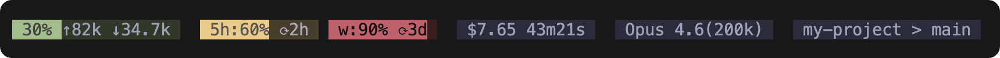
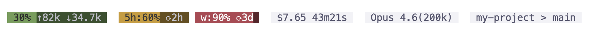

# Claude Code Stat Bar

<div align="center">

 English | [**简体中文**](./README_zh-CN.md)

A minimalist status bar for the Claude Code CLI.




[](https://opensource.org/licenses/MIT)
[](https://nodejs.org/)
[](https://www.npmjs.com/package/cc-stat-bar)

</div>

**Status bar fields:**
```text
Context usage ↑input tokens ↓output tokens | 5h usage reset countdown weekly usage reset countdown | Cost duration | Model name (context window) | Project > Branch
```
> Note: usage information is only shown for Claude subscribers.

## Requirements

- Node.js 18+
- Git

## Installation and Configuration

### Option 1: `npx` (Recommended)

Just configure Claude Code's `settings.json`. No file download is required:

```json
{
  "statusLine": {
    "type": "command",
    "command": "npx --yes cc-stat-bar"
  }
}
```

> If startup speed matters, install it globally first with `npm install -g cc-stat-bar`, then change `command` to `cc-stat-bar`.

### Option 2: Manual Installation

#### macOS / Linux

1. **Copy the script**

Copy `cc-stat-bar.js` from this project into the Claude config directory: `~/.claude/`

2. **Set permissions**

```bash
chmod +x ~/.claude/cc-stat-bar.js
```

3. **Configure your Claude Code `settings.json`**

Add the following to your Claude Code config file. Replace the `command` path with the actual script path on your machine.

```json
{
  "statusLine": {
    "type": "command",
    "command": "~/.claude/cc-stat-bar.js"
  }
}
```

#### Windows

1. **Copy the script**

Copy `cc-stat-bar.js` from this project into the Claude config directory: `C:\Users\<YourUsername>\.claude\`

2. **Configure your Claude Code `settings.json`**

Add the following to your Claude Code config file. Replace the `command` path with the actual script path on your machine.

```json
{
  "statusLine": {
    "type": "command",
    "command": "~/.claude/cc-stat-bar.js"
  }
}
```

## Uninstall

1. Run this command in Claude Code:

```bash
/statusline delete
```

2. If you installed it manually, delete `cc-stat-bar.js` from your `.claude` directory.

## Advanced Configuration

### Customize displayed modules and order

By default, all information is shown. You can append arguments after the `command` path to choose which modules to display and in what order.

**Available modules:**

- `context`: context usage and token counts
- `rateLimits`: 5-hour / 7-day token usage and reset countdown
- `cost`: accumulated cost and session duration
- `model`: current model name and context window size
- `workspace`: project directory and Git branch

### Theme Switching

Supports both `dark` (default) and `light` themes:

```json
"command": "~/.claude/cc-stat-bar.js --theme light"
```

### Configuration Examples

**Example 1: Show only context and usage**

```json
"command": "~/.claude/cc-stat-bar.js context rateLimits"
```

**Example 2: Show only model and project info**

```json
"command": "~/.claude/cc-stat-bar.js model workspace"
```

**Example 3: Custom order + light theme**

```json
"command": "~/.claude/cc-stat-bar.js --theme light model context cost"
```
