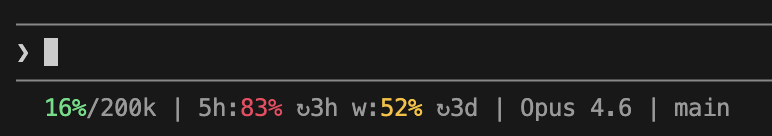

# Claude Code Stat Bar

中文 | [**English**](./README.md)

一个极简 Claude Code 命令行状态条。



**状态条信息说明：**
```bash
当前占用上下文比例/上下文上限 | 5小时内Token用量 5h重置倒计时 一周Token用量 一周重置倒计时 ｜ 当前模型名称 ｜ 当前Git分支
```
> PS：用量信息只有 Claude 登录用户才展示

## 运行要求

- Node.js 18+
- Git

## 安装与配置
### macOS / Linux
1. **拷贝脚本**

将本项目中的 `cc-stat-bar.js` 复制到 Claude 配置目录：`~/.claude/`

2. **权限设置**
```bash
chmod +x ~/.claude/cc-stat-bar.js
```

3. **配置你的 Claude Code `settings.json`**

在 Claude Code 的配置文件中加入以下内容。**注意：请将 `command` 路径替换为您电脑上的实际脚本路径。**
```json
{
  "statusLine": {
    "type": "command",
    "command": "~/.claude/cc-stat-bar.js"
  }
}
```

### Windows
1. **拷贝脚本**

将本项目中的 `cc-stat-bar.js` 复制到 Claude 配置目录：`C:\Users\您的用户名\.claude\`

2. **配置你的 Claude Code `settings.json`**

在 Claude Code 的配置文件中加入以下内容。**注意：请将 `command` 路径替换为您电脑上的实际脚本路径。**
```json
{
  "statusLine": {
    "type": "command",
    "command": "C:\\Users\\您的用户名\\.claude\\cc-stat-bar.js"
  }
}
```

## 高级配置（自定义显示内容与顺序）

默认展示所有信息。你可以通过在 `command` 路径后追加参数，来定义要展示的模块及其顺序。

**可用参数：**
- `context`：上下文信息
- `usage`：Token 用量信息
- `model`：模型信息
- `branch`：Git 分支信息

### 配置示例

**示例 1：仅展示上下文与用量**
```json
"command": "~/.claude/cc-stat-bar.js context usage"
```
> **效果：** `16%/200k | 5h:83% ↻3h w:52% ↻3d`

**示例 2：调整展示顺序**
```json
"command": "~/.claude/cc-stat-bar.js model context usage branch"
```
> **效果：** `Opus 4.6 ｜ 16%/200k | 5h:83% ↻3h w:52% ↻3d | main`
```